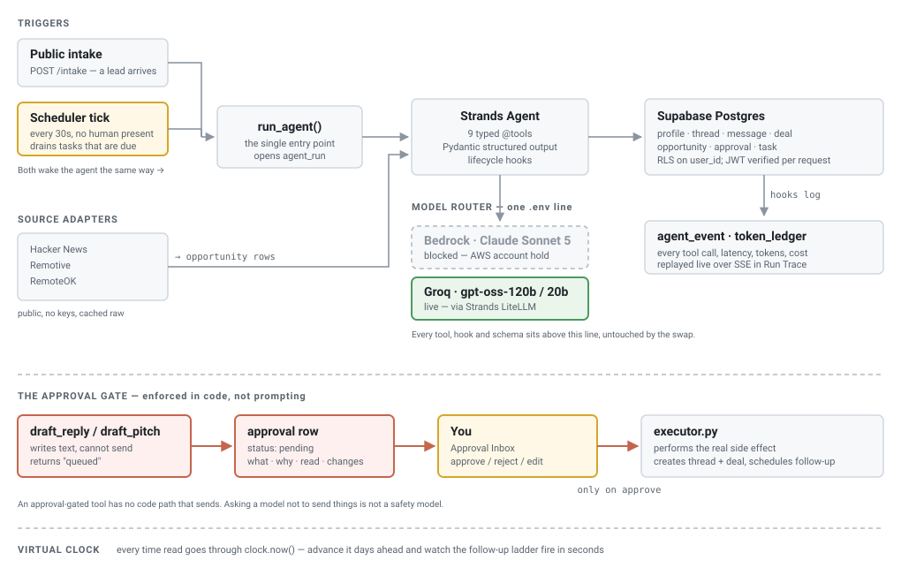

# Clockwork

**An autonomous agent that runs the business half of freelancing — so freelancers can do the work they're actually paid for.**

Built with the [Strands Agents SDK](https://strandsagents.com) for the Agents for Humans hackathon.

Freelancers don't quit because they can't do the work. They quit because of everything around it: finding leads, chasing replies, writing quotes, remembering to follow up, and asking for money. Clockwork does that half — and it does it **on a clock, while nobody is watching.**

---

## What it actually does

```
Source → Score → Pitch → Qualify → Reply → Quote → Invoice → Chase → Paid
                            └────── every outbound step: Approve ──────┘
```

1. **Sources real work** from three public feeds — Hacker News' monthly hiring thread, Remotive, and RemoteOK — filtered for contract and freelance postings, then **checks every link is still live** before spending a model call on it.
2. **Scores each one 0–100 against your real work, and shows its proof.** The scorer is handed a numbered list of your actual repositories (straight from the GitHub API), portfolio projects and skills, and every reason it gives must cite one of them. Code then checks each citation exists, drops anything invented, and caps the score: **a strong match (60+) needs a real project**, skills alone top out at 59, and no valid evidence caps it at 40. Each reason on the card links to the repository or page it rests on, so a score can be verified by clicking.
3. **Drafts a pitch when you choose to** — no pitch is drafted unasked — built on the project that earned the score. It always greets "Hi there,", because job boards give a username or a company, never a person's name.
4. **Prices the work, invoices it, and chases the money.** A quote is broken into lines the client can actually evaluate, priced off the freelancer's own rates. Once you record that the client accepted, you raise the invoice, and sending it arms a payment check whose reminder tone escalates with each one sent — because the fourth reminder reading exactly like the first is why people stop sending them.
5. **Waits for you.** Every client-facing action queues in an Approval Inbox showing four things: what it will do, why, what it read, and what changes in the database. Nothing is marked sent without a human pressing approve, and nothing is emailed at all — see Known limits.
6. **Acts on its own schedule.** Drafting a pitch or reply, or sending a quote or invoice, schedules a check-in automatically. Days later the agent wakes up, re-reads the thread, and decides whether to nudge — or correctly does nothing if the client already replied.

### Two kinds of trigger, and your own buttons

Most agents are request→response. Clockwork has two ways to wake up, and both go through `run_agent()`, the full agent loop:

- **Event** — a lead arrives through the public intake form, or you paste a client's reply into a conversation. Either way the agent reads the thread, qualifies the lead and drafts the next message for approval.
- **Time** — a scheduler drains due tasks and fires the agent with no human present: an in-process timer when running as a server, a scheduled call to `POST /tasks/tick` when hosted serverless.

That second one is the whole point, and it's why there's a **virtual clock**: every time read in the codebase goes through `clock.now()`, so you can advance the clock several days from the UI and watch the follow-up ladder fire in seconds instead of waiting a week.

---

## Architecture



**One agent loop, and buttons that skip it.** A client message, a pasted reply and the scheduler all call `run_agent(trigger)`, where the orchestrator model decides which tools to use — a scheduled run and an inbound message are the same machinery with different prompts. The buttons in the app (set up, find leads, score, pitch, quote, invoice, chase) call the same tool code directly, without the orchestrator. Both paths are recorded as runs with their steps and costs, and both go through the same approval gate.

**The approval gate is enforced in code, not prompting.** An approval-gated tool physically cannot send: it writes an `approval` row and returns "queued". A separate executor performs the side effect only after a human approves. Asking a model nicely not to send things is not a safety model.

**Everything is auditable.** Strands lifecycle hooks write every tool call, its latency, and its token cost to `agent_event`. The Run Trace screen replays any run live over SSE — every decision, every tool, and what it cost.

---

## Strands features used

| Feature | How |
|---|---|
| `@tool` | 12 typed tools: 9 change business state; `recall`, `get_thread` and `extract_requirements` only read |
| `structured_output_model=` | Pydantic schemas for fit scores, lead qualification, requirement extraction, quote line items and the profile import |
| Hooks | `BeforeToolCallEvent` / `AfterToolCallEvent` / `AfterInvocationEvent` → the `agent_event` audit trail |
| Model abstraction | One `Role` enum (orchestrator / reader / writer / extractor) routed to different models per job |

### Tests

154 tests, stdlib `unittest`, no install step:

```bash
cd apps/agent && PYTHONPATH=src python -m unittest discover -s tests -t .
```

They cover the parts where being wrong costs real money or real leads: quote arithmetic and invoice numbering, payment-terms parsing, link classification (including the false-positive direction — a posting saying "applications close on 30 September" must not be marked closed), the exception-chain walk that a shipped bug got wrong, the workflow-lane counting that another one got wrong, and the page-window arithmetic behind every paginated list — off by one there silently repeats a row on one page and drops it from the next. Every test is pure — no network, no database — so the suite runs in well under a second.

### Lists are paginated, and the totals are counted, not guessed

Every long list — opportunities, runs, threads, pipeline — is paged server-side with `?limit=&offset=`, and the unfiltered total rides back in an `X-Total-Count` header rather than being wrapped around the body, so the shape a caller parses does not change with the feature.

The counts in each screen's header are counted in the database across the whole workspace, never from the rows in hand. "84 sourced · 61 scored" that becomes "10 sourced · 7 scored" as soon as paging arrives is a worse lie than no header at all. For the same reason, dismissed opportunities are excluded by the query rather than filtered out afterwards: filtering after paging is how a page of ten arrives holding seven, and the opportunity sort carries `id` as a final tiebreak so two equally-scored postings cannot swap places between the query for page one and the query for page two.

Quotes and invoices are the deliberate exception. The Money board works out which deals are still quotable by comparing every deal against every live quote, so a half-read list there would offer to re-quote work already quoted.

### The tools

`recall` · `get_thread` · `log_message` · `extract_requirements` · `qualify_lead` · `draft_reply`\* · `schedule_task` · `score_fit` · `draft_pitch`\* · `draft_quote`\* · `draft_invoice`\* · `chase_payment`\*

\* approval-gated

### Verified leads, not just sourced ones

A posting filled three weeks ago is the worst thing to pitch: it wastes the freelancer's time and looks sloppy to the one person they were trying to impress. So every sourced link is checked before it is worth scoring, and an opportunity that comes back `gone` or `closed` **cannot be pitched** — `draft_pitch` refuses, rather than leaving it for whoever reads the approval card to notice.

Four things are checked, in the order they actually fail: the host answers; the status isn't 404/410; it didn't redirect to a site root (the "listing removed, bounced to the homepage" pattern, which returns a cheerful 200); and the body doesn't say the role is closed. A 403 or 429 is recorded as **"couldn't check"**, never as "gone" — a board blocking the checker says nothing about the role, and quietly discarding good leads would be worse than the problem being solved.

**Hacker News is checked through its item API rather than by scraping**, for two measured reasons. The web pages rate-limit hard — 19 of 28 checks came back 429 even paced 2.5 seconds apart — and the API exposes `deleted` and `dead` flags the rendered page hides, so a withdrawn posting that still *looks* fine in a browser is caught. On a real 84-posting workspace that took failures from 19 to 1 and the run from 201s to 41s, and found a genuinely deleted posting.

This is deliberately plain HTTP and not a headless browser. All three sources put the posting in the HTML response, so Playwright would cost a 400MB install and seconds per link to learn what one request already knows.

### Three rules the money tail is built on

Getting paid is the half of freelancing people avoid, and it is the half where an agent doing something plausible-but-wrong costs real money. So:

- **Python does the arithmetic, never the model.** The writer proposes line items with quantities and unit prices; totals, due dates and invoice numbers are computed in code. A model will produce a quote that adds up wrong with total confidence, and that is the one document where a wrong digit costs the freelancer money and credibility in the same email.
- **You cannot invoice work that was never agreed.** `draft_invoice` refuses unless a human has recorded the quote as accepted. "They sounded keen" is not acceptance, and there is deliberately no tool that lets the agent decide otherwise — accepting, declining and marking paid are human-only API routes.
- **Chasing escalates, and stops.** Reminder tone is driven by a written-out ladder indexed on `invoice.chase_count`, and that counter only advances when a reminder is actually approved and sent — a draft you rejected doesn't make the next one angrier. Marking an invoice paid cancels the pending chase task, because an agent that keeps dunning a client who already paid is worse than one that never chased at all.

---

## The model layer

One agent, four jobs, routed to the model that fits each — because they are not the same kind of work:

| Role | Model | Why |
|---|---|---|
| Orchestrator | `gpt-oss-120b` | Holds a long transcript and picks the right tool |
| Reader | `gpt-oss-120b` | Reads a GitHub profile and portfolio once at setup, on its own rate-limit budget |
| Writer | `gpt-oss-20b` | Client-facing prose, on its own rate-limit budget so a long orchestrator run can't starve it |
| Extractor | `gpt-oss-20b` | Scoring and classification that runs dozens of times per sync, at low reasoning effort to keep output short |

Every call site goes through the `Role` enum, never a model id — `models.py` and `ledger.invoke_model` are the only two places a provider is named. That is what makes the daily spend cap, the degrade path and the per-run cost ledger possible at all: they key off the role, not off whatever model happens to serve it.

Running on Groq via Strands' LiteLLM integration. When the day's spend crosses the cap, the orchestrator degrades to the writer's smaller model and writes a `decision` event saying so, rather than silently getting worse.

---

## Running it

**Prerequisites:** Python 3.14, Node 22, a Supabase project, and a Groq API key.

```bash
# 1. Database — run these in the Supabase SQL editor, in order
apps/agent/db/001_schema.sql
apps/agent/db/002_agent_runtime.sql
apps/agent/db/003_grants.sql
apps/agent/db/004_sourcing.sql
apps/agent/db/005_money.sql
apps/agent/db/006_accounts.sql
apps/agent/db/007_profile_fields.sql
apps/agent/db/008_link_verification.sql
apps/agent/db/009_profile_links.sql
apps/agent/db/010_account_identity.sql

# 2. Backend
cd apps/agent
cp .env.example .env        # Supabase keys + GROQ_API_KEY
python -m venv .venv && .venv/Scripts/activate
pip install -r requirements.txt
PYTHONPATH=src uvicorn clockwork.api:app --port 8000

# 3. Frontend
cd apps/web
cp .env.example .env.local  # NEXT_PUBLIC_API_URL
npm install && npm run dev
```

Then open `http://localhost:3000`. The onboarding form is the front door: filling it in creates your workspace, and you are only asked for it once — a browser that already has a profile goes straight to the dashboard.

Your work is kept until you delete it. The email you onboard with is also how you get back: **Log out** in Settings forgets this browser, `/signin` takes that email and reopens the same workspace, and **Delete this account** removes the workspace and everything in it for good. That last one is a real delete — every table cascades off the account row, and nothing is soft-deleted or kept behind the scenes.

Onboarding asks for three things and reads the rest: who you are, what you charge, and where your work lives. Required fields are starred. The last step takes a **GitHub** link, a **portfolio** link, or both — and when you press *Find me work* it reads them — your best repositories and their READMEs through the public API, the site over HTTP — to fill in your summary, extra skills and the past results pitches quote. Setup then finds leads, checks their links and scores a first batch, with a progress bar that moves as each stage really finishes, and lands on the dashboard with a summary. It drafts no pitch on its own: you pick the lead. Nobody is asked to type their own case studies into a form, because nobody enjoys that and no client asks for it either.

LinkedIn and CV upload are deliberately absent. LinkedIn blocks automated reading, so a LinkedIn field would collect a link the agent can never use; and a CV pasted as text is a worse copy of what GitHub and a portfolio already show. Optional refinements — years of experience, hours a week, a minimum project cost — live in Settings, marked optional.

To get a populated workspace without waiting on three job boards and a model provider:

```bash
cd apps/agent && python scripts/seed_demo.py
```

It prints a workspace id and the one-line cookie to set. Every row it writes is marked as demo data, and it deliberately does **not** fake agent runs, events or approvals — those are the audit trail, and inventing work the agent never did is exactly what the rest of this README refuses to do.

---

## Deploying to Vercel

Two Vercel projects from this one repository. Order matters, because each needs the other's URL.

**1. The agent API** — New Project → import the repo → **Root Directory `apps/agent`**. Vercel detects FastAPI and loads `app.py`. Add environment variables `SUPABASE_URL`, `SUPABASE_ANON_KEY`, `SUPABASE_SERVICE_ROLE_KEY`, `GROQ_API_KEY`, then deploy and copy the URL.

**2. The web app** — New Project → same repo → **Root Directory `apps/web`**. Add `NEXT_PUBLIC_API_URL` = the API's URL, then deploy and copy the URL. The build refuses to finish if this is missing or points at localhost, rather than shipping a site that can't reach its own backend.

**3. Connect them** — in the API project, add `ALLOWED_ORIGINS` = the web app's URL, then redeploy the API. Until this is set, browsers block the site from calling the API.

**4. The clock** — the API has no always-running process on Vercel, so the local 30-second scheduler does not run there. The in-app **+3d / +7d** controls still drain due tasks immediately. For the agent to also wake up on its own, set `CRON_SECRET` (any long random string) on the API project, and add repository secrets `AGENT_API_URL` and `CRON_SECRET` on GitHub; [`agent-tick.yml`](.github/workflows/agent-tick.yml) then calls `POST /tasks/tick` every five minutes. It claims at most three tasks per call, so no agent run is cut off by Vercel's 300-second limit, and the rest wait for the next tick.

---

## Layout

```
apps/agent/          FastAPI + the Strands agent
  src/clockwork/
    agent.py         run_agent() — the agent loop for messages and the scheduler
    api.py           HTTP surface (workspace header on every route bar /accounts, /intake, /health)
    audit.py         Strands hooks → agent_event
    auth.py          workspace identity (read its docstring: identifies, does not authenticate)
    clock.py         the virtual clock — every time read goes through here
    executor.py      performs approved side effects
    ledger.py        model routing spend, daily cap, structured-output validation
    models.py        per-role model routing and pricing
    overview.py      every dashboard number, computed from real rows
    scheduler.py     tick() — drains due tasks, fires the agent
    search.py        one ranked list across every entity
    sources/         one adapter per public feed, plus link verification
    tools/           the 12 agent tools (money.py = quote/invoice/chase)
  db/                SQL migrations, applied in order
  scripts/           seed_demo.py -- a populated workspace, no feeds needed
  tests/             154 stdlib unittest cases, no network, no database

apps/web/            Next.js 16 (App Router)
  src/app/
    onboarding/      the front door: profile → read GitHub/portfolio → source → check → score
    overview/        the dashboard
    workflows/       the four stages, measured by what they produced
    approvals/       the Approval Inbox, plus a history of what was sent or rejected
    opportunities/   sourced leads, ranked by fit
    money/           quotes and invoices — accept, decline, mark paid, chase
    runs/            Run Trace — live SSE replay of any agent run, including button-started work
    threads/         conversations — paste a client's reply and the agent drafts the answer
    settings/        profile, spend cap, intake link, account, locked approval gate
    search/          cross-entity search
    signin/          the way back to a workspace whose cookie is gone
    intake/[id]/     the public lead-capture form (no workspace needed)
```

---

## Known limits

Stated plainly, because a demo that hides these is worth less than one that doesn't:

- **Email is not wired.** Approving a message records it as sent and updates the thread; it does not transmit — you send it from the job board or your own email. Replies come back the same way: paste the client's answer into the conversation and the agent picks it up from there. Gmail's `gmail.send` is a restricted scope requiring a CASA Tier 2 audit, which is not achievable in a hackathon window, so it was deliberately deferred rather than half-built.
- **No payment processor.** Marking an invoice paid is a human action. There is no Stripe integration, no card data, and nothing here can move money — taking payment is not something this agent should be able to do, and faking a processor for a demo would misrepresent where the human stays in the loop.
- **No tax handling on quotes.** VAT and sales tax depend on both parties' jurisdictions, which is a real compliance question rather than one to guess at. `subtotal` and `total` are separate columns so adding it later needs no migration.
- **There is no authentication.** A workspace is created by filling in the onboarding form and identified from then on by an unguessable id in a cookie. Anyone holding that id can read and write that workspace — no password, no expiry, no revocation.

  Signing in by email is weaker still, and deliberately so. The cookie was previously the *only* route back, so clearing it stranded every row in the database behind a door that no longer existed — which is indistinguishable, from the outside, from the app never having saved anything. `/signin` trades some of the UUID's unguessability for a door the owner can find again: give the email you onboarded with and you get the workspace. No password, no verification, so anyone who knows that address can do the same.

  Both are acceptable for a demo whose data you typed in thirty seconds ago and the wrong trade for real client correspondence. `auth.py` and the Settings screen say so plainly rather than letting the word "sign in" imply a boundary that is not there.

## Licence

MIT — see [LICENSE](LICENSE).
